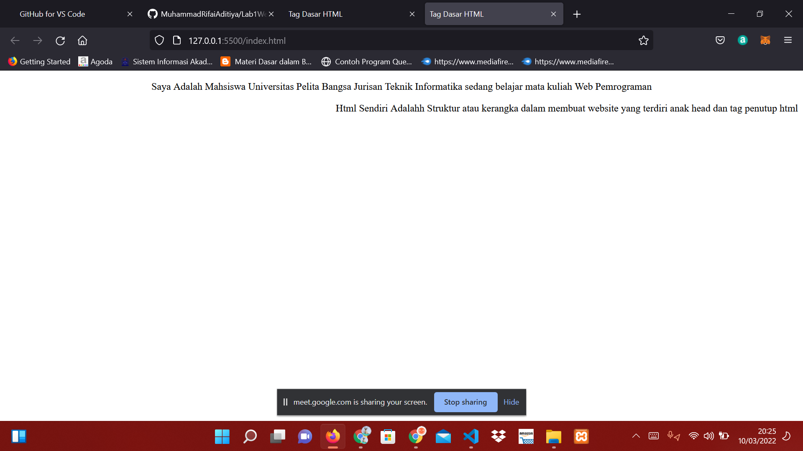
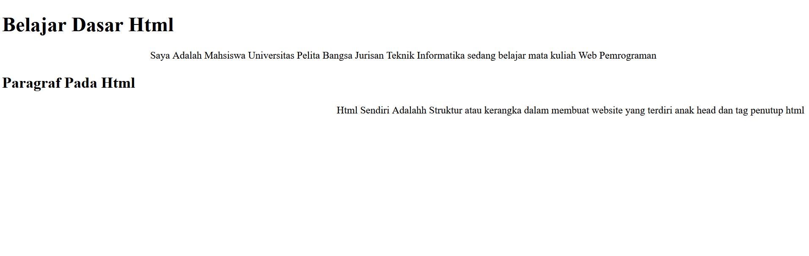
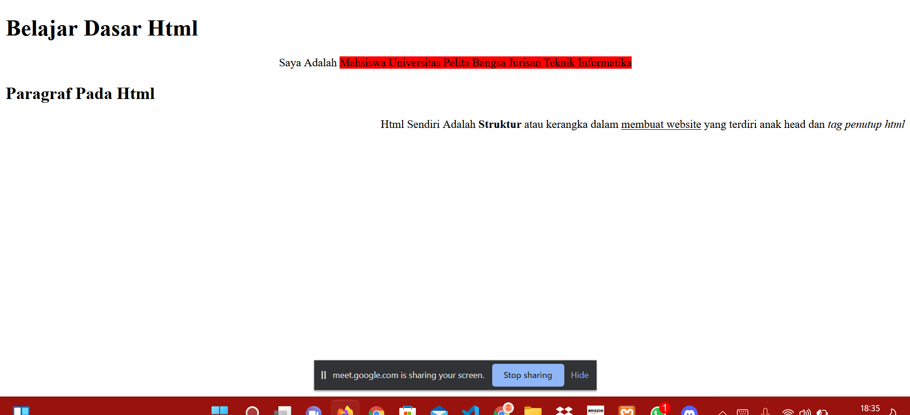
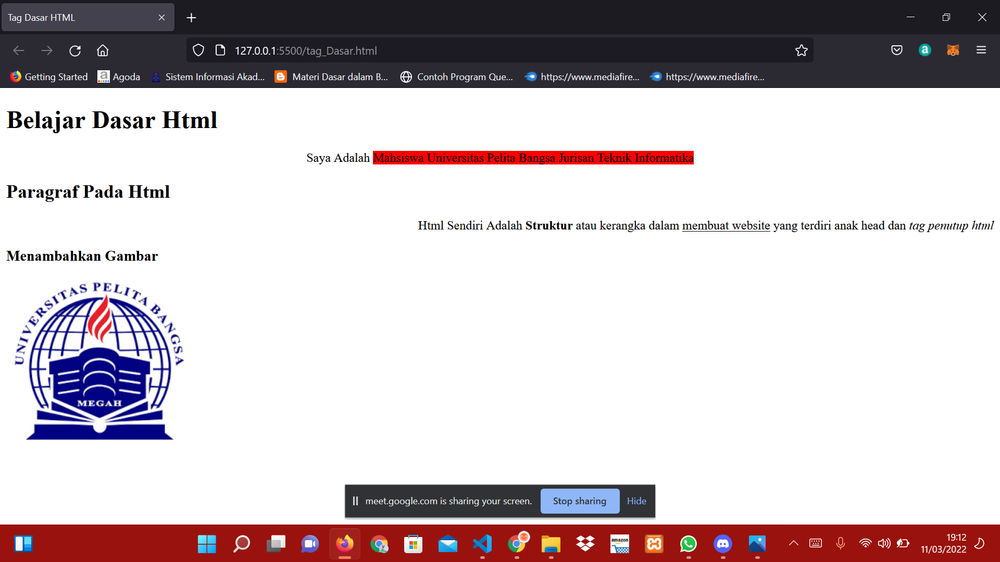
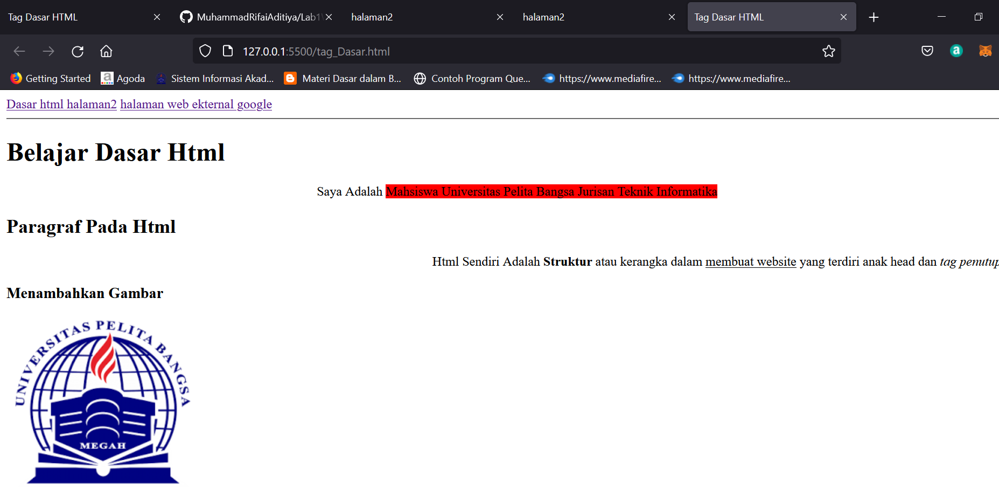

# Lab1web

|  Muhammad Rifai Aditiya |  312010065
| ------------------------|-----------
| TI.20.A.1               | Pemrograman Web
## Paragraf

Ini adalah sebuah hasil dari texs Kodingan tag <p>
 Dan Ini Adalah Codingan Dari Gambar Diatas

```html
<!DOCTYPE html>
<html lang="en">
<head>
    <meta charset="UTF-8">    <meta http-equiv="X-UA-Compatible" content="IE=edge">
    <meta name="viewport" content="width=device-width, initial-scale=1.0">
    <title>Tag Dasar HTML</title>
</head>
<body>
<!-- Paragraf Pertama -->
<p align="center">Saya Adalah Mahsiswa Universitas Pelita Bangsa Jurisan
    Teknik Informatika sedang belajar mata kuliah 
    Web Pemrograman</p>
<!-- Paragraf Kedua -->
<p align="right">Html Sendiri Adalahh Struktur atau kerangka dalam membuat website
     yang terdiri anak head dan tag penutup html </p>
```
## Heading


Ini adalah Contoh heading ,Heading sendiri adalah sebagai judul dari sebuah artikel
## Contoh Kode
```html
<!DOCTYPE html>
<html lang="en">
<head>
    <meta charset="UTF-8">    <meta http-equiv="X-UA-Compatible" content="IE=edge">
    <meta name="viewport" content="width=device-width, initial-scale=1.0">
    <title>Tag Dasar HTML</title>
</head>
<body>
<!-- Judul Paragraf Pertama -->
<h1>Belajar Dasar Html</h1>
<!-- Paragraf Pertama -->
<p align="center">Saya Adalah Mahsiswa Universitas Pelita Bangsa Jurisan
    Teknik Informatika sedang belajar mata kuliah 
    Web Pemrograman</p>
<!-- Judul Paragraf kedua -->
<h2>Paragraf Pada Html</h2>
<!-- Paragraf Kedua -->
<p align="right">Html Sendiri Adalahh Struktur atau kerangka dalam membuat website
     yang terdiri anak head dan tag penutup html </p>
</body>
</html>
```
## Teks Format


Ini adalah Contoh dari Teks format seperti Menambahkan (Span) Untuk Warna Teks atau sebuah background
## Contoh Kode
```Html
<!DOCTYPE html>
<html lang="en">
<head>
    <meta charset="UTF-8">    <meta http-equiv="X-UA-Compatible" content="IE=edge">
    <meta name="viewport" content="width=device-width, initial-scale=1.0">
    <title>Tag Dasar HTML</title>
</head>
<body>
<!-- Judul Paragraf Pertama -->
<h1>Belajar Dasar Html</h1>
<!-- Paragraf Pertama -->
<p align="center">Saya Adalah  <Span style="background-color: red;">Mahsiswa Universitas Pelita Bangsa Jurisan
    Teknik Informatika </Span> 
<!-- Judul Paragraf kedua -->
<h2>Paragraf Pada Html</h2>
<!-- Paragraf Kedua -->
<p align="right">Html Sendiri Adalah <b>Struktur</b>  atau kerangka dalam <u>membuat website</u> 
     yang terdiri anak head dan <i>tag penutup html </i></p>                                             
   
</body>
</html>
```
## Menambahkan Logo UPB

ini adalah tag Bagaimana Menambahkan foti Kedalam html yaitu dengan menggunakan tag (img) Kemduian simpan Pada Folder Yang telah dibuat

## Contoh Code
```html
<!DOCTYPE html>
<html lang="en">
<head>
    <meta charset="UTF-8">    <meta http-equiv="X-UA-Compatible" content="IE=edge">
    <meta name="viewport" content="width=device-width, initial-scale=1.0">
    <title>Tag Dasar HTML</title>
</head>
<body>
<!-- Judul Paragraf Pertama -->
<h1>Belajar Dasar Html</h1>
<!-- Paragraf Pertama -->
<p align="center">Saya Adalah  <Span style="background-color: red;">Mahsiswa Universitas Pelita Bangsa Jurisan
    Teknik Informatika </Span> 
<!-- Judul Paragraf kedua -->
<h2>Paragraf Pada Html</h2>
<!-- Paragraf Kedua -->
<p align="right">Html Sendiri Adalah <b>Struktur</b>  atau kerangka dalam <u>membuat website</u> 
     yang terdiri anak head dan <i>tag penutup html </i></p>                                                        
<!-- Sub Judul Paragraf -->
<h3>Menambahkan Gambar</h3>   
<!-- Menambahkan gambar pada Paragraf -->


</body>
</html>
```
## Menambahkan Link


Untuk menambahkan Link menggunakan (img) dan simpan dalam folder yang sesuai

## Contoh Kode
```html
<!DOCTYPE html>
<html lang="en">
<head>
    <meta charset="UTF-8">    <meta http-equiv="X-UA-Compatible" content="IE=edge">
    <meta name="viewport" content="width=device-width, initial-scale=1.0">
    <title>Tag Dasar HTML</title>
</head>
<body>
<!-- Menambahkkan link Navigasi  -->
<nav>
<a href="tag_Dasar.html">Dasar html </a>
<a href="halaman2.html">halaman2</a>
<a href="https://github.com/MuhammadRifaiAditiya/Lab1Web">halaman web ekternal google</a>
<hr>
</nav>
<!-- Judul Paragraf Pertama -->
<h1>Belajar Dasar Html</h1>
<!-- Paragraf Pertama -->
<p align="center">Saya Adalah  <Span style="background-color: red;">Mahsiswa Universitas Pelita Bangsa Jurisan
    Teknik Informatika </Span> 
<!-- Judul Paragraf kedua -->
<h2>Paragraf Pada Html</h2>
<!-- Paragraf Kedua -->
<p align="right">Html Sendiri Adalah <b>Struktur</b>  atau kerangka dalam <u>membuat website</u> 
     yang terdiri anak head dan <i>tag penutup html </i></p>                                                        
<!-- Sub Judul Paragraf -->
<h3>Menambahkan Gambar</h3>   
<!-- Menambahkan gambar pada Paragraf -->


</body>
</html>


```


